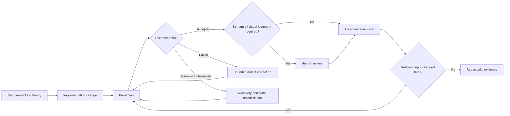

# Case Study: Emet — From Generated Output to Evidence-Backed Delivery

## Context

As AI-assisted development accelerated across multiple projects, a recurring problem became obvious: **successful execution was too easy to confuse with successful delivery**.

A model could generate code, a command could pass, or a test suite could complete while an important requirement, environment difference, recovery path, or evaluation boundary was still wrong.

Emet grew from that problem.

It began as governance practice and evolved into software-backed tooling intended to make engineering state more inspectable: what changed, what owns the decision, what evidence supports the claim, what remains unknown, and what proof should be rerun after a change.

## The problem

Several classes of failure repeatedly created unnecessary rework or false confidence:

- requirements existed in planning material but were not always present in the implementation prompt or evaluation context;
- automated execution could succeed while human behavioral evaluation still failed;
- a local result could differ from Preview or another deployed environment;
- interrupted campaigns, callbacks, review handoffs, or evidence handling could leave execution outcome uncertain;
- rerunning large proof suites without identifying what actually changed consumed time while adding little information;
- a technically correct implementation could still miss the intended product experience if the implementation references were incomplete.

The goal was not to add process for its own sake. The goal was to make the existing delivery lifecycle easier to inspect and harder to misrepresent.

## What I directed

Emet work has included executable capabilities for:

- repository inspection;
- work/risk classification;
- policy and requirement resolution;
- proof planning;
- evidence reuse and invalidation decisions;
- durable evidence records;
- advisory GitHub review and reporting;
- reconciliation of incomplete, failed, blocked, superseded, and accepted proof states.

The core operating principle is simple:

> **Implemented is not the same as integrated. Integrated is not the same as certified. Certified is not automatically the same as deployed or released.**

## Simplified evidence flow

This is a sanitized portfolio view of the reasoning flow, not the internal Emet implementation.

The important idea is that proof has a lifecycle. A failure can belong to implementation, proof, environment, recovery, or an unsupported assumption; those categories should not automatically trigger the same response.

## A representative lesson: requirement/evaluation parity

One major behavioral-certification effort exposed a subtle problem. Long-form requirements and evaluation expectations existed, but not every inspected implementation or review artifact carried the complete requirement context.

That meant a clean execution path could still be evaluating the wrong thing.

The improvement direction was not "add more prompts." It was to bind the important identities together:

- requirement identity;
- the actual assembled request;
- test or evaluation case identity;
- review material;
- the rubric used to accept or reject the result.

This creates a more inspectable chain between **what was required** and **what was judged**.

## A representative lesson: recovery is part of correctness

Another class of failures involved campaign lifecycle and recovery: interrupted execution, timeouts, callback routing, evidence movement, or uncertainty about whether a remote action completed.

A blind retry can create duplicate work or make the evidence harder to interpret.

The better pattern is to model the whole lifecycle explicitly:

`intent -> dispatch -> outcome or unknown -> durable record -> review -> acceptance`

Recovery then becomes something that can be tested synthetically before an expensive or consequential campaign is run.

## A representative lesson: reuse valid proof

One of the most useful efficiency lessons was that not every change justifies rerunning every accepted test.

Evidence can remain valid when the relevant:

- authority;
- dependency;
- contract;
- environment;
- evaluation rule;
- and freshness requirement

have not changed in a way that affects the supported claim.

The inverse also matters: matching code or artifact hashes alone are not enough when an applicable environment, policy, dependency, or rubric changed.

This became an evidence-reuse/invalidation problem rather than a "rerun everything" problem.

A small runnable, synthetic example of that decision model is available in [`../demo/`](../demo/README.md). It intentionally contains no private Emet source code or project evidence.

## My role

My role in Emet has centered on:

- identifying recurring failure patterns from real delivery work;
- turning those failures into bounded rules and software requirements;
- defining authority and evidence boundaries;
- directing AI-assisted implementation of the tooling;
- reviewing whether the tooling actually addresses the failure mode rather than only the visible symptom;
- preserving accepted evidence where it remains valid;
- preventing ordinary defects from being mislabeled as architectural or governance failures;
- keeping read-only review separate from execution authority.

## What this demonstrates

This project is less about writing code than about **building an operating system for trustworthy AI-assisted delivery**.

The professional capabilities it demonstrates include:

- technical program structure;
- requirements traceability;
- root-cause analysis;
- risk-based validation;
- evidence management;
- recovery planning;
- disciplined use of AI-generated implementation;
- separating confidence from proof.

## Current claim boundary

Emet is an active product-development effort. This case study describes demonstrated governance and tooling capabilities; it does not claim that every planned Emet capability is complete, commercially released, or appropriate for unattended production authority.

The examples are intentionally sanitized. Private source code, controlled records, credentials, internal identifiers, and security-sensitive implementation details are not included.
