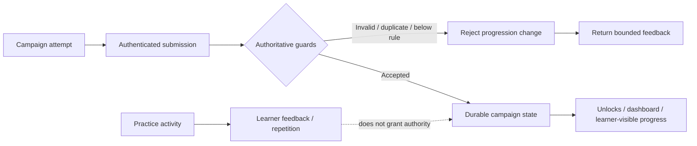

# Case Study: Riff & Rondo — Building Reliable Progression Into a Learning Product

## Context

Riff & Rondo is a music-learning product built around guided practice and campaign-style progression.

The engineering challenge is not simply presenting lessons. Progression has to remain authoritative: attempts, scores, unlocks, persistence, notation, browser input, and learner-visible state all need to agree about what actually happened.

That made the project a useful proving ground for state ownership, persistence, progression rules, learner UX, and automated testing.

## The product problem

A learning product can feel correct while still having weak authority boundaries.

Examples include:

- a client showing progress that the server never durably accepted;
- duplicate submissions changing progress twice;
- Practice behavior accidentally granting Campaign authority;
- a score or unlock rule being represented differently across UI, persistence, and tests;
- notation, accessibility, or browser input behaving correctly in one path but failing in another;
- a test suite proving a local implementation while hosted behavior remains unverified.

The system therefore needed a clear distinction between **practice interaction** and **authoritative progression**.

## Selected systems I directed

Riff & Rondo work represented in this portfolio includes:

- Practice and Campaign learning flows;
- authenticated persistence and learner dashboards;
- server-owned campaign progression;
- score-threshold and unlock rules;
- duplicate-submission protection;
- theory-learning foundations;
- musical notation rendering using VexFlow;
- pedagogy and learner-feedback work;
- accessibility and mobile-focused improvements;
- browser audio, MIDI, and microphone input setup;
- automated tests and CI support;
- release-readiness and current-state revalidation work.

## Simplified progression-authority view

This is a conceptual portfolio diagram, not a publication of the private implementation.

The key boundary is intentional: a useful Practice interaction should not silently become authoritative Campaign progression.

## Practice is not authority

One important architectural distinction is that practice activity and authoritative campaign advancement serve different purposes.

Practice can help a learner explore, repeat, and improve without automatically changing the durable campaign state.

Campaign advancement requires the authoritative path to accept the attempt and progression result.

That separation prevents a convenient client-side interaction from becoming the source of truth for progression.

## Progression needs server-owned rules

A representative campaign rule used a score threshold of **70 or higher** for progression.

The important engineering point is not the specific number. It is that the progression decision belongs to the authoritative system rather than being inferred only by the interface.

That drove work around:

- attempt lifecycle;
- authoritative submission;
- duplicate protection;
- unlock state;
- durable persistence;
- tests that prove both accepted and rejected paths.

The evidence reviewed for this portfolio does **not** establish a complete server-issued `start_attempt → submit_attempt` lifecycle. That remained a separate successor work item, so the existing progression proof is not used here to claim that broader lifecycle is complete.

## Testing the intended guard

A negative test is only valuable when it actually exercises the guard it claims to prove.

For example, a request that fails authentication before it ever reaches a progression rule does not prove that the progression rule rejects an invalid attempt.

The better pattern is to include valid controls and make sure the failing case reaches the intended boundary.

That lesson carried forward into the broader Emet validation work.

## Hosted state is a separate claim

Another recurring lesson from Riff & Rondo is that repository state, local tests, and hosted behavior are different evidence environments.

A feature may be implemented and well-tested while the current hosted deployment identity has not been freshly verified.

The portfolio therefore does not use local or repository proof to imply a fresh production-release claim.

## My role

My role has included:

- defining product progression behavior and learner-facing requirements;
- separating Practice behavior from Campaign authority;
- directing AI-assisted implementation across persistence, UI, notation, input, and testing;
- reviewing progression and duplicate-protection logic;
- designing and interpreting acceptance tests;
- identifying when test failures proved the wrong boundary;
- distinguishing implemented functionality from fresh hosted certification.

## What this demonstrates

Riff & Rondo demonstrates:

- product-state and authority modeling;
- authenticated persistence;
- progression and duplicate-protection design;
- learner-centered UX and accessibility thinking;
- browser media/input integration;
- automated testing and negative-path reasoning;
- applying operational ownership concepts to a consumer learning product.

## Current claim boundary

This case study describes implemented and tested product capabilities from the development program. It does not claim a freshly verified current commercial release state, and it does not publish private learner data, source code, credentials, or internal product records.
