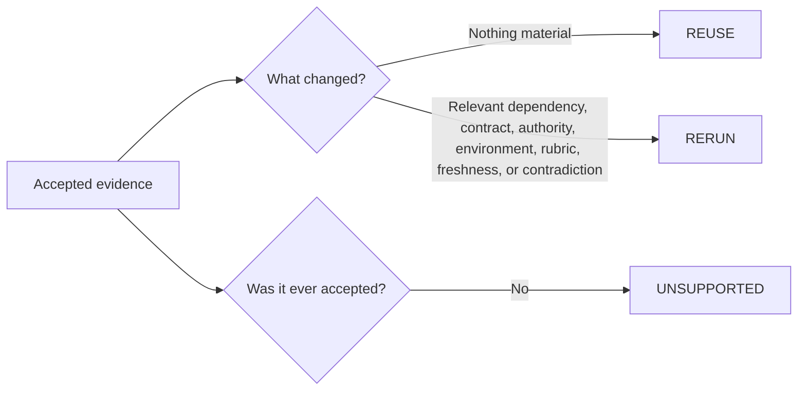

# Synthetic Evidence Reuse Demo

This small runnable example demonstrates one principle from the portfolio's validation methodology:

> Accepted evidence should be reused when it still supports the claim, and rerun only when a relevant authority, dependency, contract, environment, evaluation rule, freshness requirement, or contradiction invalidates it.

The demo is deliberately **synthetic**. It contains no KaelUX, Emet, or Riff & Rondo production code, private project data, proprietary prompts, credentials, or internal evidence records.

## What it does

The script compares a synthetic change manifest with prior evidence records and classifies each record as:

- `REUSE` — the prior accepted evidence still supports the claim;
- `RERUN` — something material changed and fresh proof is warranted;
- `UNSUPPORTED` — the prior record was never accepted evidence for the claim.

This is a simplified teaching example, not the Emet product implementation.

## Run it

From the repository root:

```bash
python demo/evidence_reuse_demo.py demo/sample_change.json demo/sample_evidence.json
```

For machine-readable output:

```bash
python demo/evidence_reuse_demo.py demo/sample_change.json demo/sample_evidence.json --json
```

Run the tests with:

```bash
python -m unittest demo.test_evidence_reuse_demo
```

No third-party packages are required.

## Expected sample result

The supplied sample demonstrates all three decision states:

- authentication/session evidence is reusable because its relevant inputs did not change;
- provider-identity evidence requires a rerun because its dependency changed and fresh proof is explicitly required;
- companion-behavior evidence requires a rerun because the evaluation rule changed;
- a blocked Production-release record remains unsupported rather than being promoted to success.

## Why this belongs in the portfolio

The point is not the size of the script. The point is the reasoning model it makes inspectable:



That same discipline is described more fully in [`../evidence/methodology.md`](../evidence/methodology.md).
